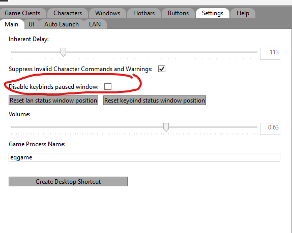

[Home](home)

## Keybinds

Keybinds can be set for a button via the Edit button screen. Boxcar implements a global key listener and will determine if a mapped keybind has been pressed at anytime in any program. If this the case boxcar will execute the associated command(s).


### Syntax
keybinds do not share the same syntax as Actions within a [command](commmands). 

\<keypress>
OR
\<mod>+\<keypress>


The keypress can be found from the supported key [list](keypress). Keybinds currently only support 1 key modification.

Supported Mods:
- shift
- alt
- ctrl


Example:
```
numpad1

OR

shift+numpad1
```

### Priority


A button with a keybind should be assigned an appropriate priority if other buttons share the keybind.

Button commands will be executed in descending priority order. Example: Priority 1 > Priority 0.

### Keybind Paused Window
Boxcar displays a window with a resume button and info about using a keybind to resume and pause keybinds.

This window can be disabled via the settings tab -> main settings and disable keybind pause window checkbox.



### Warning


<font color="red">The main boxcar menu must be minimized for keybinds to work and keybinds will not be recognized while boxcar
is actively issuing commands.</Span>

Keybinds may not work under some conditions. Due to limitations of windows OS not being able to SetTheForeground Window.</font>

[Details Here](https://learn.microsoft.com/en-us/windows/win32/api/winuser/nf-winuser-setforegroundwindow#remarks)

Using the auto launch feature can address these conditions in most cases.


Keybinds can be paused and resumed via the Boxcar tray icon menu. This is useful if you are needing
to type or are using another program that has conflicting keybinds.