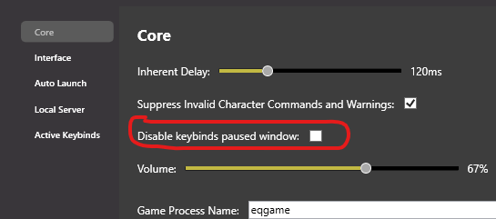

🏠 [Home](boxcar://home)

# ⌨️ Keybinds

Keybinds can be set for a button via the **Edit button** screen. Boxcar implements a **global key listener**, which determines if a mapped keybind has been pressed at any time in any program. If this occurs, Boxcar will execute the associated command(s).

---

## 📝 Syntax

Keybinds share the same syntax as the mod and key Actions within a [command](boxcar://commands).

- `mod.shift+ctrl+alt.key.<keypress>`
- **OR**
- `key.<keypress>`

The `<keypress>` can be found from the supported key [list](boxcar://keypress).

### Supported Mods:
- **shift**
- **alt**
- **ctrl**

Example:
```js
key.numpad1

// OR

mod.shift.key.numpad1

// OR

mod.shift+alt.key.1
```

---

## ⏳ Priority

If multiple buttons share the same keybind, you should assign an appropriate **priority**.

- Button commands will be executed in **descending priority order**.  
  Example: `Priority 1 > Priority 0`.

---

## 🪟 Keybind Paused Window

Boxcar displays a window with a **resume button** and information about using a keybind to resume and pause keybinds.

- This window can be disabled via the **settings tab** → **main settings** and unchecking the **Disable Keybind Pause Window** checkbox.

> 

---

## ⚠️ Warning 

The main Boxcar menu must be **minimized** for keybinds to work, and keybinds will **not** be recognized while Boxcar is actively issuing commands.

Keybinds may not function under certain conditions due to **limitations in Windows OS**, preventing the use of the **SetForegroundWindow** function.

> [Details Here](https://learn.microsoft.com/en-us/windows/win32/api/winuser/nf-winuser-setforegroundwindow#remarks)

Using the **auto launch feature** can address these conditions in most cases.

---

## ⏸️ Pausing and Resuming Keybinds 

Keybinds can be paused and resumed via the **Boxcar tray icon menu**. This is useful if you need to type or use another program that has conflicting keybinds.

## 🔥 Active Keybinds

To debug and understand what keybinds are being observed, view the active keybinds section in settings. 
