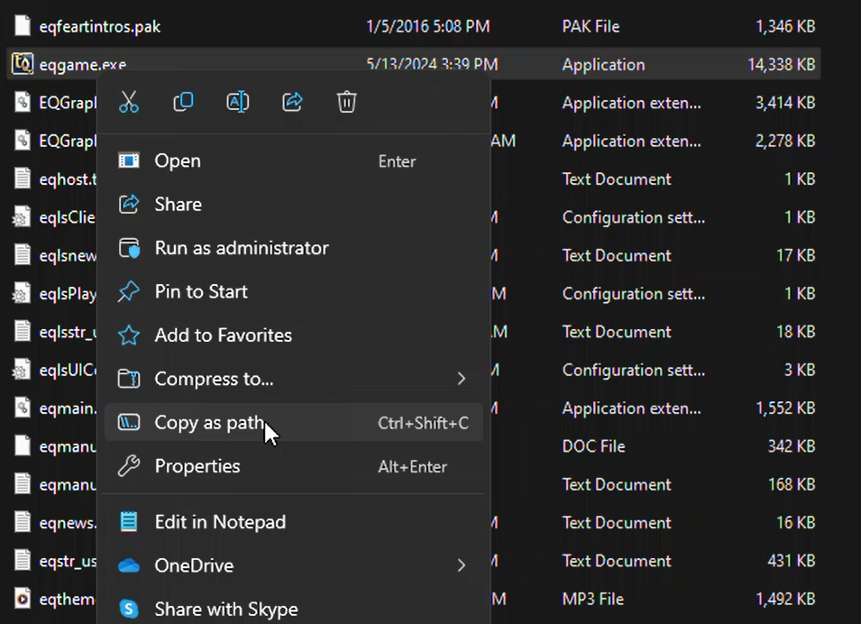
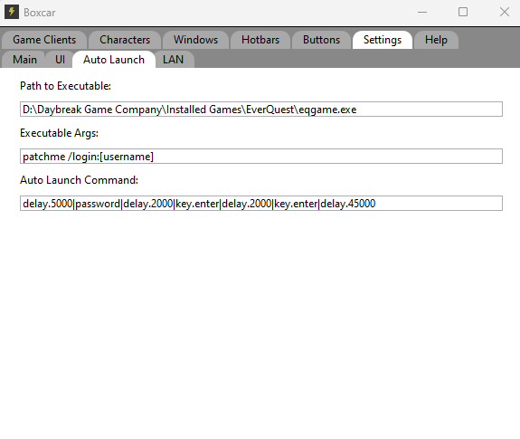

[Home](home)
## Auto Launch

Auto Launch will launch a game client for each enable character.

The game client is launched by a defined path to an executable file. 


This will launch a game client. The system will wait for the processes main window to be created. There is also a arguments field that can be edited and this will be passed as arguments when invoking the executable.

### Executable

The executable is the game executable that you want to launch. We will use everquest as an example.

In the everquest directory you will find the eqgame.exe file. You can get the path to executable by right clicking the file and selecting **copy as path**.



You can then paste this path into the Path to Executable field. Do not include any quote marks.



### Executable Args

Boxcar will invoke the executable and will pass the string provided in executable args as the argument to the invocation.

There are 2 special strings that can be used in the arguments field. [username] and [password]. Include the bracket.

These strings will be replaced with the username and password stored for that character.

### Auto Launch Command

Once a process is launched and the window is created the Launch command will be executed. The launch command uses the same syntax as the game [commands](commands).

There are 2 custom Actions that can be used in the launch command that are only valid in auto launch.

- password
	+ This will type the password associated to that character
	
- username
	+ This will type the username associated to that character

Example:
```
delay.5000|username|key.tab|delay.1000|password|key.enter|delay.5000|key.enter
```

